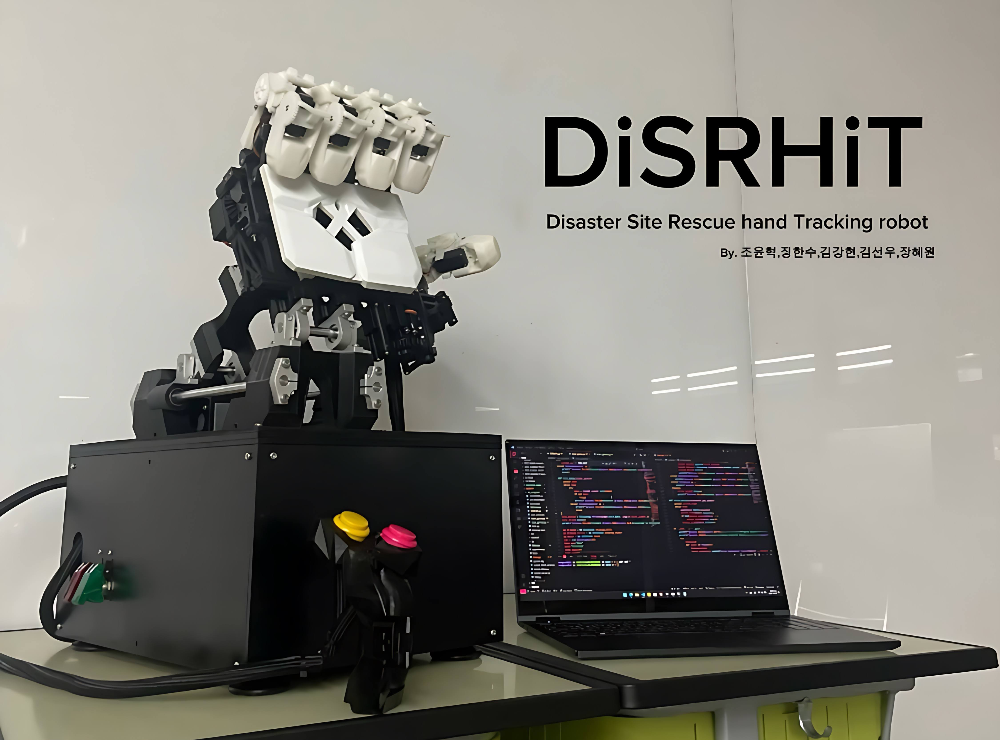

# 🦾 **DiSRHiT**  
*Disaster Site Rescue Hand Tracking Robot*  
> 2023 미래산업과학고등학교 메이커창작과 교내대회 (일경험) - 인공지능 로봇 손

  

## 🎞 Product Video
🔗 [Watch here](https://m.youtube.com/watch?v=zfUQFC6qfBE)   

## ⚡ Team
**Blackout_Retech** 🏴‍☠️

## 🛠️ Maker
김강현(Software), 조윤혁(Leader & Electronic), 장한수(Engineering), 김선우(Engineering), 장혜원(Design) 

## 📅 Production Period
⏳ 2023.3 ~ 2023.12

## 📂 Engineering Files
📁 None 

---

## 🦾 **DiSRHiT - Disaster Site Rescue Hand Tracking Robot**  
> **인공지능 로봇 손**: 지진과 같은 재난 현장에서 구조 작업을 돕기 위한 기술

### 제작 동기 💡  
사람이 직접 재난 현장에서 접근하기 어려운 경우나, 접근이 어려운 장소에서 섬세한 작업이 필요한 경우, 구조 작업을 돕는 로봇을 개발하였습니다. 이를 위해 **모션 트래킹** 기술을 사용하여 사용자의 손을 실시간으로 인식하고, 로봇 손이 이를 똑같이 재현하도록 하였습니다. 

---

## DiSRHiT 소프트웨어 및 기술 설명 🖥️

### 📐 **모션 트래킹 및 각도 구하기**  
손가락을 인식하고, 각 손가락 관절의 각도를 구하여 로봇 손이 사용자의 손 모양을 그대로 따라 할 수 있도록 합니다.

- **Hand Motion Tracking**  
  - Mediapipe 라이브러리를 사용하여 손을 인식하고 트래킹합니다.  
  - 각 손가락의 관절 랜드마크를 정의하여 해당 위치에 OpenCV 라이브러리로 점을 찍어줍니다.
  - **참고 이미지**: 손가락 랜드마크 사용 예시
  
- **Find Finger Joint Angle**  
  - Python의 Numpy와 OpenCV 라이브러리로 손가락 관절 간의 각도를 계산합니다.
  - 3개의 랜드마크를 사용해 각도를 계산하고, 카메라 각도에 따라 정확도가 달라질 수 있습니다. 개선 방법을 연구 중입니다.

### ⚙ **서보모터 동시 제어**  
서보모터를 사용하여 손가락의 각 관절을 제어합니다.

- **손가락 관절 위치 설정**  
  - 총 12개의 모터를 제어하기 위해 **PCA9685 서보모터 드라이버**를 사용했습니다.
  
- **Thread를 사용한 동시 제어**  
  - Python의 `threading` 라이브러리를 사용하여 여러 모터를 동시에 제어합니다.
  - 이를 통해 동시에 12개의 모터를 제어할 수 있습니다.

### 📡 **인공지능 PC와 로봇 손(Raspberry Pi) 간 통신**  
**소켓 통신**을 사용하여 AI와 로봇 손 간 데이터를 주고받습니다.

- **소켓 통신(Sockets)**  
  - **Pysocket** 라이브러리 사용.
  - 블루투스 통신 대신 **Socket 통신**을 사용하여 안정적인 데이터 전송을 구현합니다.
  
- **통신 방법**  
  - 클라이언트와 서버 소켓을 이용해 양방향 통신을 구현하였습니다.
 
---

## DiSRHiT 조작 메뉴얼 📝

### 1️⃣ **라즈베리파이 접속 명령어 (SSH)**  
> 접속 명령어: `ssh rkdgus0810@[ip address(inet)] -p 22`  
- 접속 후, 라즈베리파이 명령어 창이 열립니다.

### 2️⃣ **디렉토리 이동**  
> `cd Desktop`  
> `cd AI-Hand`

### 3️⃣ **가상환경 활성화**  
> `source bin/activate`  
- `(AI-Hand)`가 앞에 뜨면 성공!

### 4️⃣ **소켓 통신 주소 확인**  
1. **IP 주소 조회**  
   > `ifconfig`  

2. **VScode에서 `main.py` 파일 열기**  
   - **Host 변수 값**과 `ifconfig`로 확인한 IP 주소가 같은지 확인하세요.

### 5️⃣ **라즈베리파이 코드 실행**  
1. 초록 레버를 ON으로 설정합니다.  
2. 코드 실행:  
   > `python main.py`  
- **서버가 시작되면 IP 주소와 포트 번호가 출력됩니다.**

### 6️⃣ **로컬 컴퓨터(AI) 코드 실행**  
VScode 터미널에서 다음 명령어 실행:  
> `python main.py`  
- 통신이 시작되면 성공적으로 연결됩니다! (초록색 글자로 표시됨)

## ⚠️ **참고 및 주의 사항!!**  
- **작동 실패 시**: "소켓 통신 주소 확인"을 다시 한 번 확인하세요.
- 메뉴얼 순서가 중요합니다!
- 대소문자 구분을 엄격히 확인해주세요!  

## **🎉 마무리**  
DiSRHiT는 재난 현장에서 구조 작업을 돕는 혁신적인 로봇 손으로, 사람의 손동작을 실시간으로 추적하고, 섬세하게 반응할 수 있는 시스템입니다. 기술적 발전이 이루어짐에 따라, 더욱 정확하고 효율적인 구조 작업이 가능해질 것입니다.

**💬 궁금한 점이 있으면 언제든지 문의 주세요!**
